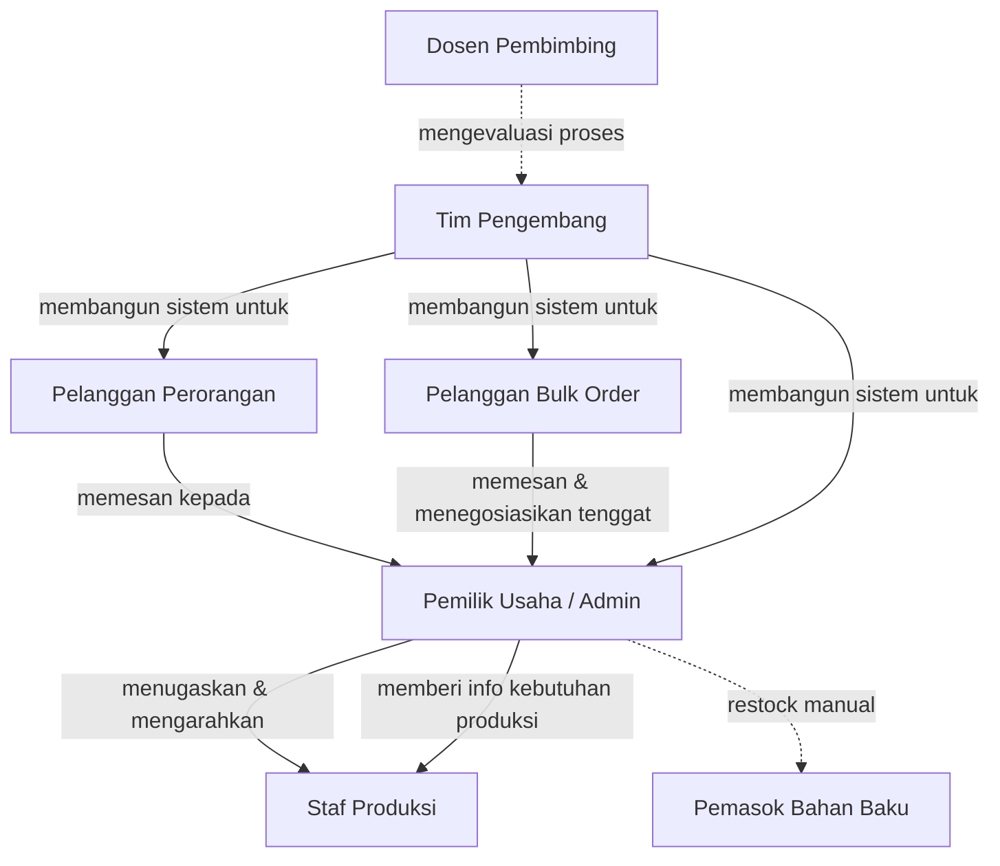
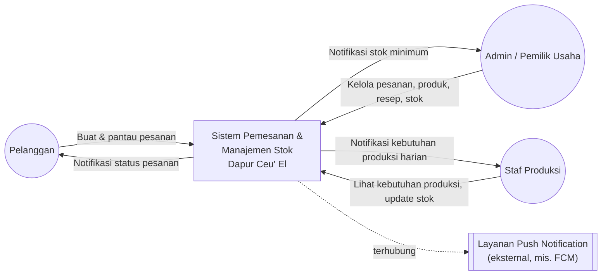
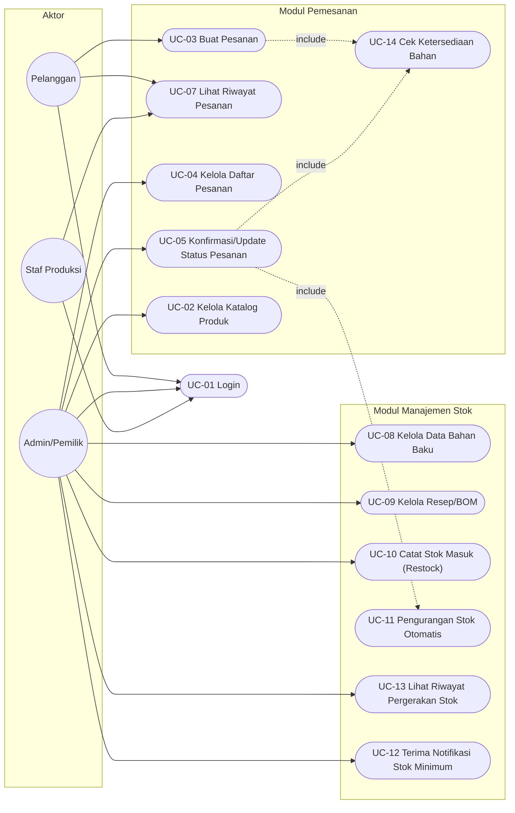
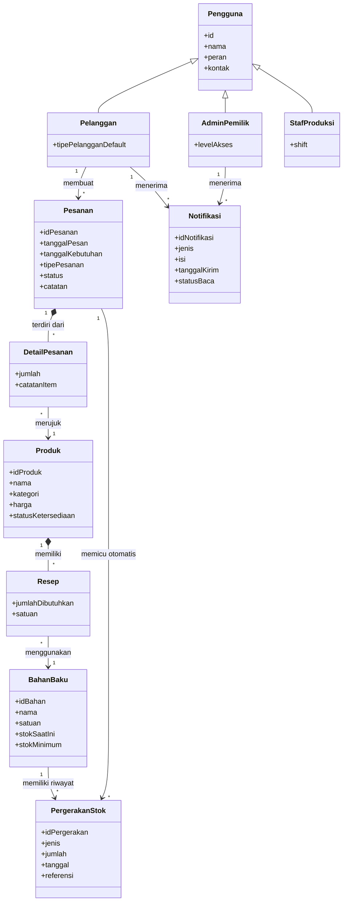
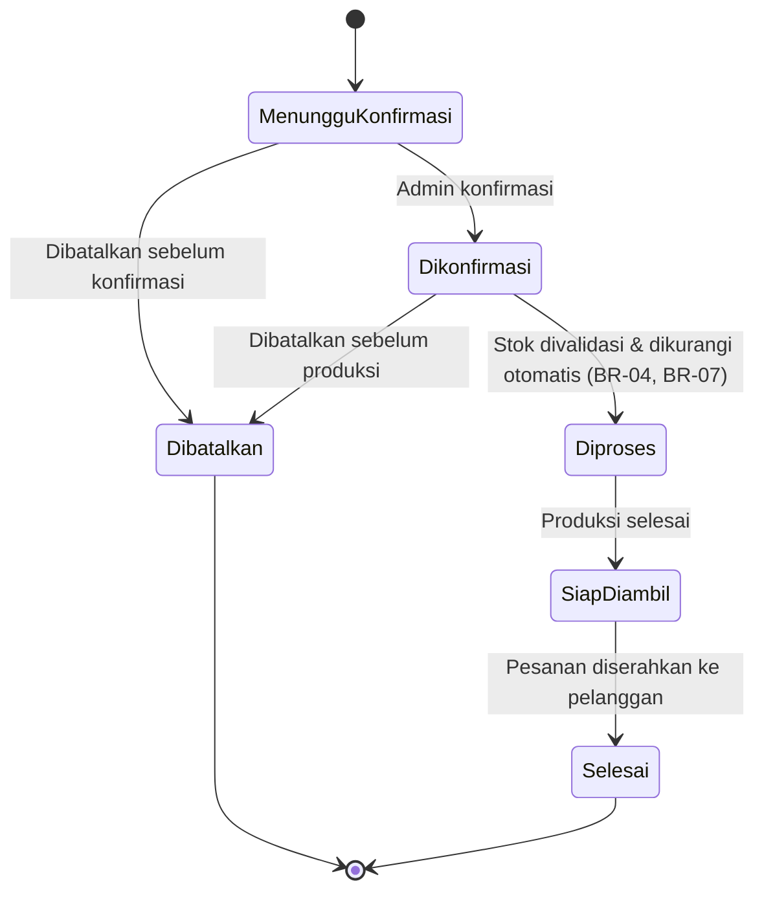
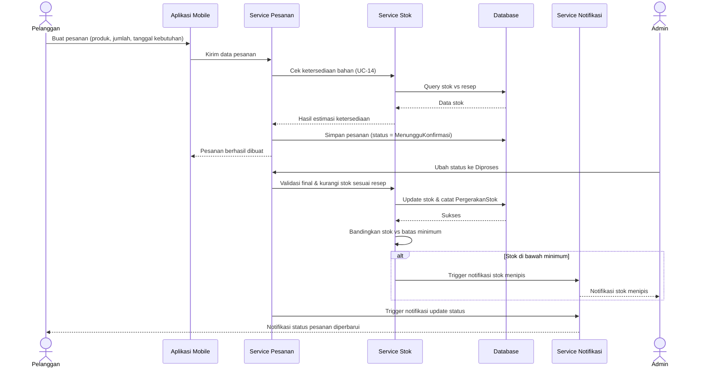
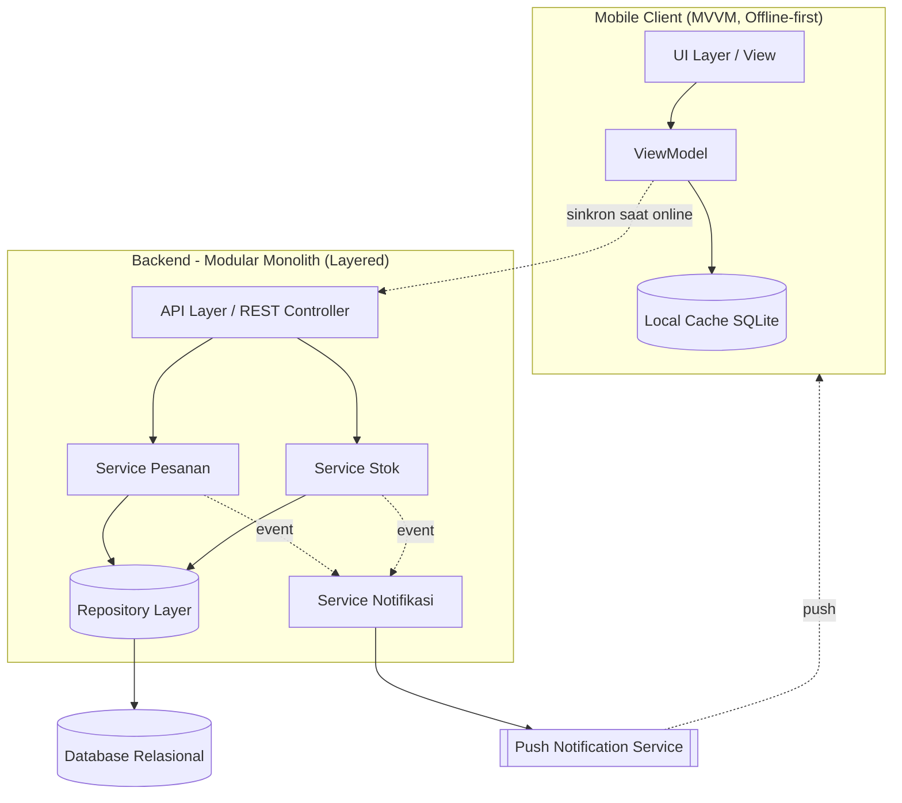

# DOKUMEN ACUAN ANALISIS DAN PERANCANGAN SISTEM
## Sistem Pemesanan dan Manajemen Stok Produksi — Dapur Ceu' El

**Versi:** 1.0 (Draft Acuan Awal) | **Tanggal:** 26 Juni 2026
**Disusun oleh:** Farras Ahmad Rasyid (231524006), Nieto Salim Maula (231524019), Satria Permata Sejati (231524026) — Kelas 3A D4 Teknik Informatika
**Status:** Untuk divalidasi pemilik usaha & dosen pembimbing sebelum dilanjutkan ke SRS, SDD, dan Prototype

---

> ### ⚠️ Catatan Perubahan Ruang Lingkup (Penting)
> Deskripsi studi kasus awal mencakup 5 area fitur: (1) katalog produk, (2) alur pemesanan digital, (3) pencatatan transaksi & riwayat, (4) manajemen stok bahan baku, (5) dasbor laporan penjualan. **Berdasarkan arahan terbaru, ruang lingkup proyek dipersempit hanya pada dua sistem inti: "Sistem Pemesanan" dan "Sistem Manajemen Stok".**
>
> Karena pembatasan ini tidak merinci secara eksplisit apa yang terjadi pada fitur katalog dan pencatatan transaksi, dokumen ini mengambil **asumsi kerja berikut** (ditandai 🔶 *Asumsi* di seluruh dokumen, dan perlu dikonfirmasi ke pemilik usaha/dosen):
> 1. **Katalog produk tetap ada**, tetapi diposisikan sebagai bagian *fungsional pendukung* dari Sistem Pemesanan (pelanggan butuh melihat produk & harga untuk bisa memesan) — bukan modul terpisah.
> 2. **Pencatatan data pesanan (sebagai transaksi) tetap ada** sebatas yang diperlukan untuk alur pemesanan (riwayat pesanan, status), **namun pencatatan keuangan rinci dan dasbor laporan penjualan/pendapatan dikeluarkan dari ruang lingkup** pada iterasi ini.
> 3. **Keterkaitan otomatis antara Pemesanan dan Stok dipertahankan** (pengurangan stok bahan baku berbasis resep/BOM saat pesanan diproses), karena ini adalah akar masalah utama yang disebutkan dalam deskripsi kasus (kehabisan bahan baku saat produksi berlangsung) dan tanpa keterkaitan ini, Sistem Manajemen Stok tidak dapat berfungsi secara realtime sesuai tujuan awal.
>
> Seluruh bagian dokumen ini disusun konsisten dengan tiga asumsi di atas. Jika asumsi ini tidak sesuai arahan, bagian terkait dapat direvisi tanpa mengubah struktur keseluruhan dokumen.

---

## Daftar Isi
1. Pendahuluan
2. Konteks Bisnis dan Organisasi
3. Analisis Stakeholder
4. Kebutuhan Sistem (Fungsional & Non-Fungsional)
5. Konteks Sistem, Aktor, dan Fungsi Utama
6. Model Use Case
7. Model Analisis (Conceptual Model)
8. Arsitektur Sistem
9. Design Pattern
10. Quality Attributes dan Kualitas Antarmuka
11. Kesiapan Menuju SRS, SDD, dan Prototype
12. Lampiran: Ringkasan Asumsi

---

## 1. Pendahuluan

### 1.1 Tujuan Dokumen
Dokumen ini disusun sebagai **acuan analisis dan desain awal (pre-SRS/pre-SDD)** sebelum penyusunan dokumen *Software Requirements Specification* (SRS), *Software Design Description* (SDD), dan prototype (wireframe/high-fidelity) untuk sistem informasi **Pemesanan** dan **Manajemen Stok Produksi** pada usaha rumahan Dapur Ceu' El. Secara spesifik, dokumen ini bertujuan untuk:

1. Menyatukan pemahaman tim pengembang mengenai tujuan bisnis, lingkungan operasional, dan aturan bisnis yang berlaku, sebagai dasar yang **tervalidasi** untuk seluruh kebutuhan turunan.
2. Mengidentifikasi seluruh stakeholder, hubungan antar-stakeholder, serta menyusun persona yang merepresentasikan kebutuhan riil pengguna, sehingga keputusan desain dapat **ditelusuri (traceable)** ke kebutuhan pengguna.
3. Menyusun model analisis (conceptual model), use case, arsitektur, dan design pattern awal yang **konsisten** dan dapat dipertanggungjawabkan argumentasinya (termasuk trade-off), sebagai fondasi SDD.
4. Memastikan atribut kualitas (*quality attributes*) sesuai ISO/IEC 25010 teridentifikasi sejak tahap kebutuhan, agar dapat diverifikasi pada tahap desain dan prototype (termasuk kesesuaian dengan ISO 9241-110 / heuristik Nielsen untuk kualitas antarmuka).

### 1.2 Target Pengguna Dokumen
| Target Pengguna | Kebutuhan terhadap Dokumen |
|---|---|
| Tim pengembang (penyusun: Farras, Nieto, Satria) | Acuan tunggal sebelum menulis SRS & SDD agar konsisten |
| Dosen pembimbing/penilai mata kuliah | Bukti proses analisis kebutuhan & desain yang terstruktur dan tervalidasi |
| Pemilik usaha Dapur Ceu' El (calon pengguna sistem) | Memvalidasi bahwa kebutuhan bisnis & operasionalnya benar dipahami |
| Tim penyusun SRS/SDD/Prototype pada tahap selanjutnya | Sumber rujukan tunggal (single source of truth) untuk requirement, model, dan rasional desain |

### 1.3 Definisi, Istilah, dan Akronim
Seluruh istilah berikut digunakan **konsisten** di sepanjang dokumen ini maupun dokumen turunannya (SRS/SDD):

| Istilah/Akronim | Penjelasan |
|---|---|
| **SRS** | *Software Requirements Specification* — dokumen rinci kebutuhan perangkat lunak |
| **SDD** | *Software Design Description* — dokumen rinci desain perangkat lunak |
| **FR** | *Functional Requirement* / Kebutuhan Fungsional |
| **NFR** | *Non-Functional Requirement* / Kebutuhan Non-Fungsional |
| **BOM** | *Bill of Material* — komposisi/resep bahan baku yang dibutuhkan untuk membuat satu unit produk |
| **Stok Minimum** | Ambang batas jumlah bahan baku; jika stok berada pada/di bawah ambang ini, sistem memicu notifikasi peringatan |
| **Bulk Order** | Pesanan dalam jumlah besar untuk keperluan acara (hajatan, arisan, hampers, pernikahan), berbeda dari pesanan satuan/perorangan |
| **UMKM** | Usaha Mikro, Kecil, dan Menengah |
| **ISO/IEC 25010** | Standar internasional model kualitas produk perangkat lunak (mencakup *Functional Suitability*, *Interaction Capability*, dll.) |
| **ISO 9241-110** | Standar internasional prinsip dialog interaksi manusia-komputer (ergonomi antarmuka) |
| **Heuristik Nielsen** | 10 prinsip evaluasi *usability* antarmuka oleh Jakob Nielsen |
| **CRUD** | *Create, Read, Update, Delete* — operasi dasar manajemen data |
| **RBAC** | *Role-Based Access Control* — kontrol akses berdasarkan peran pengguna |
| **API** | *Application Programming Interface* |
| **REST** | *Representational State Transfer* — gaya arsitektur API berbasis HTTP |
| **FCM** | *Firebase Cloud Messaging* — layanan push notification |
| **MVVM** | *Model-View-ViewModel* — pola arsitektur pemisahan UI dan logika |
| **Offline-first** | Strategi desain agar aplikasi tetap dapat dipakai tanpa koneksi internet stabil, dengan sinkronisasi saat koneksi tersedia |
| **Traceability** | Kemampuan menelusuri keterkaitan antara requirement dengan sumber kebutuhannya (stakeholder/persona/goal) |

### 1.4 Ruang Lingkup Sistem

**Termasuk dalam ruang lingkup (in-scope):**
- Katalog produk (nama, kategori, harga, status ketersediaan) — 🔶 *Asumsi*, sebagai pendukung Sistem Pemesanan.
- Alur pemesanan digital (satuan & bulk order) dengan status dan konfirmasi.
- Riwayat pesanan per pelanggan dan per admin.
- Notifikasi otomatis perubahan status pesanan.
- Manajemen data bahan baku (CRUD, satuan, stok saat ini, stok minimum).
- Manajemen resep/BOM per produk.
- Pencatatan pergerakan stok (masuk/keluar), baik manual (restock) maupun otomatis (akibat pesanan diproses).
- Notifikasi peringatan stok mendekati/di bawah batas minimum.
- Validasi ketersediaan bahan baku terhadap resep sebelum pesanan dikonfirmasi.

**Tidak termasuk dalam ruang lingkup (out-of-scope) pada iterasi ini:**
- Pencatatan keuangan rinci (pemasukan/pengeluaran, laba-rugi).
- Dasbor laporan penjualan/analitik produk terlaris berbasis pendapatan.
- Integrasi pembayaran (payment gateway).
- Manajemen relasi dengan pemasok/supplier bahan baku (pemesanan ke supplier) — restock dicatat manual oleh admin.
- Manajemen kepegawaian/payroll.

---

## 2. Konteks Bisnis dan Organisasi

### 2.1 Profil Organisasi (Organizational Environment)
Dapur Ceu' El adalah usaha rumahan (UMKM) di bidang kuliner berlokasi di Kota Cimahi, Jawa Barat, dengan spesialisasi kue basah, kue kering, dan bolu. Struktur organisasi bersifat sederhana dan datar (*flat*): pemilik usaha berperan ganda sebagai manajer, admin operasional, dan turut terlibat langsung dalam produksi; dapat dibantu oleh staf produksi (jumlah terbatas, skala rumahan). Pengambilan keputusan terpusat pada pemilik. Saat ini tidak ada divisi/departemen formal (tidak ada bagian keuangan, gudang, atau IT terpisah) — seluruh proses (pemesanan, pencatatan stok, pelaporan) dijalankan manual oleh pemilik melalui WhatsApp dan catatan tulisan tangan.

### 2.2 Lingkungan Operasional (Operational Environment)
| Aspek | Kondisi Saat Ini | Implikasi untuk Sistem |
|---|---|---|
| Lokasi kerja | Dapur rumahan/produksi rumah tangga, area terbatas, kemungkinan jaringan internet rumahan yang tidak selalu stabil | Sistem perlu mendukung mode **offline-first** untuk pencatatan stok |
| Perangkat | Pemilik & pelanggan diasumsikan menggunakan **smartphone Android** kelas menengah-bawah 🔶 *Asumsi* | Aplikasi harus ringan, kompatibel dengan Android versi menengah ke bawah |
| Waktu operasional | Produksi & penerimaan pesanan berlangsung sepanjang hari kerja, termasuk dini hari menjelang acara besar 🔶 *Asumsi* | Sistem harus tersedia (*available*) hampir sepanjang waktu, notifikasi tidak boleh terlambat |
| Pola komunikasi saat ini | WhatsApp + catatan tangan, tidak terstruktur | Sistem perlu menggantikan fungsi ini dengan antarmuka terstruktur namun tetap sederhana (karena pengguna terbiasa pola komunikasi informal) |
| Literasi digital pengguna | Pemilik & pelanggan terbiasa aplikasi chat/medsos, belum tentu terbiasa aplikasi bisnis kompleks 🔶 *Asumsi* | Antarmuka harus sederhana, sesuai prinsip *learnability* (ISO 9241-110/Nielsen) |

### 2.3 Tujuan Bisnis (Business Goals)
Tujuan bisnis dirumuskan secara **spesifik dan terukur (SMART)** sebagai target awal yang diusulkan tim, untuk divalidasi bersama pemilik usaha:

| Kode | Tujuan Bisnis | Target Terukur |
|---|---|---|
| BG-01 | Mengurangi pesanan yang terlewat/terlambat dikonfirmasi | Menurunkan kejadian pesanan terlewat hingga ≥90% dalam 3 bulan pertama penggunaan sistem |
| BG-02 | Mempercepat konfirmasi status pesanan kepada pelanggan | Waktu konfirmasi turun dari rata-rata >2 jam (manual via WA) menjadi <15 menit (notifikasi otomatis) |
| BG-03 | Mencegah kehabisan bahan baku saat produksi berlangsung | Menurunkan kejadian kekurangan bahan mendadak saat produksi ≥95% melalui notifikasi stok minimum realtime |
| BG-04 | Meningkatkan akurasi pencatatan stok bahan baku | Selisih stok fisik vs stok tercatat di sistem <2% pada audit bulanan |
| BG-05 | Mempersingkat waktu pengecekan ketersediaan bahan sebelum menerima bulk order besar | Dari manual (>30 menit pengecekan catatan) menjadi instan (<1 menit) melalui validasi otomatis sistem |

### 2.4 Manfaat Sistem (Benefits)
Manfaat dirumuskan selaras dan **terukur** terhadap tujuan bisnis di atas:

- **Bagi pemilik usaha:** visibilitas tunggal atas seluruh status pesanan (mengurangi risiko pesanan terlewat sesuai BG-01); peringatan dini stok kritis (mendukung BG-03 & BG-04) sehingga keputusan restock lebih cepat dan tepat.
- **Bagi pelanggan:** kepastian status pesanan tanpa harus menunggu balasan chat manual (mendukung BG-02), khususnya penting bagi pelanggan bulk order yang memesan untuk acara dengan tanggal tetap (pernikahan, hajatan).
- **Bagi staf produksi:** kejelasan kebutuhan bahan baku harian berbasis resep, mengurangi miskomunikasi lisan.
- **Bagi keberlangsungan usaha:** dasar pengambilan keputusan operasional (bukan finansial, sesuai pembatasan ruang lingkup) yang lebih terstruktur dibanding catatan tangan, mendukung pertumbuhan volume pesanan tanpa menambah risiko operasional secara proporsional.

### 2.5 Aturan Bisnis (Business Rules)
| Kode | Aturan Bisnis | Sumber |
|---|---|---|
| BR-01 | Produk dikategorikan menjadi kue basah, kue kering, dan bolu | Eksplisit dari deskripsi kasus |
| BR-02 | Pesanan dapat berupa pesanan satuan (perorangan) atau bulk order (hajatan, arisan, hampers, pernikahan) | Eksplisit dari deskripsi kasus |
| BR-03 | Setiap produk memiliki resep (BOM) yang menentukan jenis & jumlah bahan baku yang dibutuhkan per unit | 🔶 Asumsi (diperlukan agar pengurangan stok otomatis dapat dihitung) |
| BR-04 | Pesanan tidak dapat dikonfirmasi/masuk status "Diproses" apabila stok bahan baku tidak mencukupi kebutuhan resep | 🔶 Asumsi, turunan langsung dari akar masalah di deskripsi kasus |
| BR-05 | Setiap bahan baku memiliki batas stok minimum; sistem wajib mengirim notifikasi saat stok mencapai/di bawah batas tersebut | Eksplisit dari deskripsi kasus |
| BR-06 | Setiap perubahan status pesanan harus tercatat beserta waktunya dan memicu notifikasi ke pelanggan | Eksplisit dari deskripsi kasus (kebutuhan "konfirmasi status secara langsung") |
| BR-07 | Pengurangan stok bahan baku terjadi otomatis saat pesanan berpindah ke status "Diproses", bukan saat pesanan baru dibuat | 🔶 Asumsi, untuk mencegah pengurangan stok pada pesanan yang masih berstatus "Menunggu Konfirmasi"/berpotensi batal |
| BR-08 | Restock (penambahan stok) hanya dapat dilakukan oleh Admin/Pemilik | 🔶 Asumsi (kontrol akses dasar) |
| BR-09 | Pesanan bulk order memerlukan kolom tanggal kebutuhan/acara yang wajib diisi, berbeda dengan pesanan satuan yang bersifat lebih segera | 🔶 Asumsi, turunan dari sifat bulk order untuk acara terjadwal |

**Status validasi Bagian 2:** seluruh poin Goals, Business Rules, Operational & Organizational Environment di atas perlu dikonfirmasi langsung ke pemilik usaha (terutama poin bertanda 🔶 *Asumsi*) sebelum ditetapkan final dalam SRS — lihat metode validasi pada Bagian 4.4.

---

## 3. Analisis Stakeholder

### 3.1 Identifikasi Stakeholder
| Stakeholder | Kategori | Peran terhadap Sistem |
|---|---|---|
| Pemilik usaha Dapur Ceu' El | Primer, internal | Admin utama: kelola produk, resep, stok, konfirmasi pesanan; pengambil keputusan bisnis |
| Staf produksi (jika ada) | Primer, internal | Pengguna pendukung: melihat kebutuhan produksi, membantu update stok |
| Pelanggan perorangan | Primer, eksternal | Membuat pesanan satuan, memantau status |
| Pelanggan bulk order (event organizer, calon pengantin, panitia hajatan/arisan) | Primer, eksternal | Membuat pesanan jumlah besar dengan tenggat acara, butuh kepastian lebih tinggi |
| Tim pengembang sistem | Sekunder, internal proyek | Membangun & memelihara sistem sesuai requirement |
| Dosen pembimbing/penilai | Sekunder | Mengevaluasi kesesuaian proses analisis-desain dengan standar akademik |
| Pemasok bahan baku | Sekunder, eksternal | Tidak berinteraksi langsung dengan sistem (di luar ruang lingkup), namun keberadaannya memengaruhi proses restock manual oleh admin |

### 3.2 Hubungan Antar Stakeholder

**Catatan:** Pemasok bahan baku tidak menjadi aktor langsung sistem (tidak ada modul pemesanan ke supplier dalam ruang lingkup ini), namun hubungannya tetap relevan secara bisnis karena memengaruhi *timing* restock yang dicatat manual oleh Admin.

### 3.3 Persona
**Persona 1 — "Bu Lela", Pemilik & Admin (45 tahun)**
- **Goals:** Mengetahui status seluruh pesanan secara cepat; mengetahui bahan baku yang kritis sebelum kehabisan; mengurangi kesalahan pencatatan manual.
- **Skenario penggunaan:** Setiap pagi, Bu Lela mengecek pesanan yang masuk semalam melalui WhatsApp sambil menyiapkan bahan produksi; karena kesibukan, ia kadang lupa mencatat pesanan ke buku, sehingga ada pesanan yang dua kali tercatat atau justru tidak tercatat sama sekali.
- **Pain points:** Kehabisan bahan baku saat produksi sudah berjalan; pesanan ganda/terlewat; harus berulang kali menjawab pelanggan yang menanyakan status pesanan; tidak terbiasa aplikasi yang rumit.
- **Implikasi desain:** Dashboard tunggal status pesanan; validasi & notifikasi stok otomatis; antarmuka dengan langkah minimal dan istilah sederhana.

**Persona 2 — "Rina", Pelanggan Perorangan (29 tahun, karyawan kantor)**
- **Goals:** Memesan kue dengan cepat tanpa perlu menunggu balasan chat; mendapat kepastian pesanan sudah diterima.
- **Skenario penggunaan:** Rina memesan bolu untuk ulang tahun anaknya di sela waktu kerja, dan butuh konfirmasi cepat agar bisa merencanakan acara.
- **Pain points:** Harus menunggu balasan WhatsApp yang kadang lama; tidak ada bukti tertulis status pesanan.
- **Implikasi desain:** Form pemesanan singkat (≤3 langkah); notifikasi otomatis saat status berubah; riwayat pesanan yang dapat dilihat kapan saja.

**Persona 3 — "Pak Yusuf", Pelanggan Bulk Order / Panitia Pernikahan (38 tahun)**
- **Goals:** Memesan dalam jumlah besar jauh-jauh hari; memastikan ketersediaan & jadwal produksi terpenuhi tepat waktu untuk acara penting.
- **Skenario penggunaan:** Pak Yusuf memesan 500 pcs kue kering untuk acara pernikahan 1 bulan sebelumnya, dan sangat khawatir jika pesanan tidak terpenuhi karena tanggal acara tidak bisa diundur.
- **Pain points:** Tidak ada konfirmasi tertulis formal; kekhawatiran soal kepastian pemenuhan pesanan besar.
- **Implikasi desain:** Field tanggal kebutuhan acara wajib diisi pada bulk order; validasi ketersediaan bahan baku ditampilkan saat pesanan dibuat (estimasi), bukan baru diketahui saat dikonfirmasi.

**Persona 4 — "Dede", Staf Produksi (24 tahun)**
- **Goals:** Mengetahui resep & jumlah bahan yang harus disiapkan setiap hari sesuai pesanan yang masuk.
- **Skenario penggunaan:** Dede menyiapkan bahan produksi setiap pagi berdasarkan informasi lisan dari Bu Lela, yang terkadang tidak lengkap atau berubah mendadak.
- **Pain points:** Informasi pesanan & stok hanya ada di kepala/buku pemilik; miskomunikasi soal jumlah bahan yang harus disiapkan.
- **Implikasi desain:** Tampilan ringkas kebutuhan bahan baku per pesanan yang sedang "Diproses" (terhubung otomatis ke data resep/BOM).

### 3.4 Sintesis Experience → Implikasi Keputusan Desain
| Pain Point (dari persona) | Keputusan Desain | Requirement Terkait |
|---|---|---|
| Kehabisan bahan saat produksi berjalan | Validasi stok otomatis terhadap resep sebelum pesanan dikonfirmasi + notifikasi stok minimum realtime | FR-08, FR-13 (Bagian 4.1) |
| Pesanan ganda-catat / terlewat | Dashboard terpusat daftar pesanan dengan status yang selalu terlihat | FR-04, FR-05 |
| Pelanggan tidak yakin status pesanannya | Notifikasi otomatis setiap perubahan status + halaman riwayat pesanan | FR-06, FR-07 |
| Pemilik kurang terbiasa aplikasi kompleks | Alur pembuatan pesanan & update stok maksimal beberapa langkah, istilah sederhana, ikon visual jelas (selaras prinsip *learnability* & *recognition rather than recall*) | NFR-03, Bagian 10.2 |
| Bulk order butuh kepastian lebih tinggi untuk acara bertanggal tetap | Estimasi ketersediaan bahan ditampilkan di awal pembuatan pesanan, bukan hanya saat konfirmasi akhir | FR-02, FR-08 |
| Staf produksi butuh kejelasan kebutuhan bahan harian | Tampilan kebutuhan bahan per pesanan "Diproses" terhubung otomatis ke BOM | FR-09, FR-15 |

---

## 4. Kebutuhan Sistem

### 4.1 Kebutuhan Fungsional (Functional Requirements)
**Modul Pemesanan**
| ID | Kebutuhan Fungsional | Terkait Persona/Stakeholder |
|---|---|---|
| FR-01 | Sistem menampilkan katalog produk (nama, foto, kategori, harga, status ketersediaan) | Rina, Pak Yusuf |
| FR-02 | Pelanggan dapat membuat pesanan baru (satuan atau bulk order) dengan memilih produk, jumlah, dan tanggal kebutuhan | Rina, Pak Yusuf |
| FR-03 | Sistem menyimpan detail pesanan (data pelanggan, daftar item, jumlah, catatan khusus, tanggal kebutuhan) | Bu Lela |
| FR-04 | Admin dapat melihat seluruh pesanan masuk dalam satu tampilan beserta statusnya | Bu Lela |
| FR-05 | Admin dapat mengubah status pesanan (Menunggu Konfirmasi → Dikonfirmasi → Diproses → Siap Diambil → Selesai / Dibatalkan) | Bu Lela |
| FR-06 | Sistem mengirim notifikasi otomatis ke pelanggan saat status pesanan berubah | Rina, Pak Yusuf |
| FR-07 | Sistem menampilkan riwayat pesanan per pelanggan dan per admin | Rina, Pak Yusuf, Bu Lela |
| FR-08 | Sistem memvalidasi ketersediaan bahan baku terhadap resep produk sebelum pesanan dapat dikonfirmasi/diproses | Bu Lela, Pak Yusuf |
| FR-09 | Sistem menampilkan ringkasan kebutuhan bahan baku untuk pesanan yang sedang berjalan (perencanaan produksi operasional, bukan laporan keuangan) | Dede |

**Modul Manajemen Stok**
| ID | Kebutuhan Fungsional | Terkait Persona/Stakeholder |
|---|---|---|
| FR-10 | Sistem mencatat data bahan baku (nama, satuan, stok saat ini, batas stok minimum) | Bu Lela |
| FR-11 | Admin dapat menambah/mengurangi stok bahan baku secara manual (restock, koreksi) | Bu Lela |
| FR-12 | Sistem mengurangi stok bahan baku secara otomatis berdasarkan resep/BOM saat pesanan berpindah ke status "Diproses" | Bu Lela, Dede |
| FR-13 | Sistem mengirim notifikasi peringatan ke Admin saat stok bahan mendekati/di bawah batas minimum | Bu Lela |
| FR-14 | Sistem menampilkan riwayat pergerakan stok (masuk/keluar) bahan baku | Bu Lela |
| FR-15 | Admin dapat mengelola data resep/BOM (komposisi bahan baku per produk) | Bu Lela, Dede |
| FR-16 | Sistem menampilkan daftar bahan baku dengan status stok kritis dalam satu tampilan ringkas | Bu Lela |

**Lintas Modul**
| ID | Kebutuhan Fungsional |
|---|---|
| FR-17 | Sistem menyediakan autentikasi & otorisasi berbasis peran (Admin/Pemilik, Staf Produksi, Pelanggan) |
| FR-18 | Sistem dapat diakses melalui aplikasi mobile (Android) |

### 4.2 Kebutuhan Non-Fungsional (NFR) & Pemetaan ISO/IEC 25010
| ID | Kebutuhan Non-Fungsional | Karakteristik ISO 25010 |
|---|---|---|
| NFR-01 | Waktu respons pembuatan pesanan dan update stok ≤3 detik pada koneksi 4G standar | *Performance Efficiency* |
| NFR-02 | Sistem tersedia (*uptime*) minimal 99% pada jam operasional (06:00–20:00) | *Reliability* (Availability) |
| NFR-03 | Pengguna baru (Admin) dapat menyelesaikan tugas inti (buat pesanan, update stok) tanpa pelatihan formal dalam <10 menit penggunaan pertama | *Interaction Capability* (Learnability) |
| NFR-04 | Data pelanggan & pesanan terenkripsi saat transmisi (HTTPS/TLS); akses dibatasi berdasarkan peran (RBAC) | *Security* |
| NFR-05 | Jika koneksi internet terputus saat pencatatan stok, data disimpan sementara lokal dan disinkronkan otomatis saat koneksi tersedia kembali | *Reliability* (Fault tolerance, Recoverability) |
| NFR-06 | Penambahan produk/bahan baku baru tidak memerlukan perubahan kode program (dikonfigurasi via antarmuka admin) | *Maintainability* |
| NFR-07 | Aplikasi mobile kompatibel pada Android versi 8.0 ke atas | *Compatibility* / *Portability* |
| NFR-08 | Sistem memberi konfirmasi/peringatan sebelum aksi yang tidak dapat dibatalkan (hapus pesanan/stok) | *Interaction Capability* (User error protection) |
| NFR-09 | Notifikasi stok minimum & status pesanan diterima dalam ≤30 detik sejak peristiwa terjadi (selama perangkat online) | *Performance Efficiency* / *Reliability* |

### 4.3 Matriks Traceability (Requirement → Stakeholder/Persona → Goal)
| Requirement | Stakeholder/Persona | Business Goal | Status Validasi |
|---|---|---|---|
| FR-01, FR-02 | Rina, Pak Yusuf | BG-02 | Tervalidasi konsep ✅ (perlu validasi pemilik 🔶) |
| FR-03, FR-04, FR-05, FR-06, FR-07 | Bu Lela, Rina, Pak Yusuf | BG-01, BG-02 | Tervalidasi konsep ✅ |
| FR-08, FR-09 | Bu Lela, Pak Yusuf, Dede | BG-03, BG-05 | Tervalidasi konsep ✅ |
| FR-10, FR-11, FR-14 | Bu Lela | BG-04 | Tervalidasi konsep ✅ |
| FR-12, FR-13, FR-16 | Bu Lela, Dede | BG-03, BG-04 | Tervalidasi konsep ✅ |
| FR-15 | Bu Lela, Dede | BG-03, BG-05 | Tervalidasi konsep ✅ |
| FR-17, FR-18 | Seluruh aktor pengguna | Mendasari seluruh BG | Tervalidasi konsep ✅ |
| NFR-01–NFR-09 | Seluruh aktor pengguna | Mendukung seluruh BG (kualitas layanan) | Tervalidasi konsep ✅ |

**Cakupan traceability saat ini: 18 dari 18 FR (100%) dan seluruh NFR memiliki keterkaitan eksplisit ke stakeholder/persona dan goal — memenuhi target ≥80%.** "Tervalidasi konsep" berarti tertelusur secara logis dari deskripsi kasus dan persona; validasi final tetap memerlukan konfirmasi langsung pemilik usaha (lihat 4.4).

### 4.4 Metode Validasi Kebutuhan
1. **Review bersama stakeholder kunci** (pemilik usaha) untuk setiap poin bertanda 🔶 *Asumsi* — dilakukan melalui wawancara terstruktur atau walkthrough dokumen ini.
2. **Cross-check traceability**: memastikan setiap FR/NFR baru yang muncul pada tahap SRS tetap dapat ditelusuri ke salah satu persona/goal pada dokumen ini; requirement yang tidak dapat ditelusuri ditandai untuk diklarifikasi, bukan langsung dimasukkan ke SRS.
3. **Konsistensi istilah**: setiap requirement diperiksa menggunakan istilah pada glosarium (Bagian 1.3) untuk mencegah ambiguitas makna antar dokumen (acuan → SRS → SDD).
4. **Validasi melalui prototype** (tahap selanjutnya): walkthrough skenario persona pada wireframe/prototype, serta evaluasi heuristik (Nielsen/ISO 9241-110) sebagai validasi kualitas interaksi — lihat Bagian 10.2 dan 11.

---

## 5. Konteks Sistem, Aktor, dan Fungsi Utama

### 5.1 Diagram Konteks

### 5.2 Definisi Aktor
| Aktor | Jenis | Deskripsi |
|---|---|---|
| Pelanggan | Eksternal, manusia | Memesan produk (satuan/bulk), memantau status & riwayat pesanan |
| Admin/Pemilik Usaha | Internal, manusia | Mengelola seluruh data master (produk, resep, bahan baku), memproses pesanan, memantau stok |
| Staf Produksi | Internal, manusia | Melihat kebutuhan produksi & melakukan update stok terbatas (akses lebih sempit dari Admin) 🔶 *Asumsi peran* |
| Layanan Push Notification (FCM) | Eksternal, sistem | Mengirimkan notifikasi ke perangkat pelanggan/admin |

### 5.3 Fungsi Utama Sistem
Seluruh fungsi utama berikut diturunkan langsung dari FR pada Bagian 4.1, dipastikan **tidak ada fungsi inti yang terlewat** dari dua ruang lingkup (Pemesanan & Stok):

1. **Manajemen Katalog & Resep** — FR-01, FR-15
2. **Pemrosesan Pesanan End-to-End** (pembuatan → validasi stok → konfirmasi → produksi → selesai) — FR-02, FR-03, FR-04, FR-05, FR-08
3. **Notifikasi & Riwayat** — FR-06, FR-07
4. **Manajemen Bahan Baku & Stok** — FR-10, FR-11, FR-14, FR-16
5. **Pengurangan Stok Otomatis Berbasis Produksi** — FR-12, FR-09
6. **Peringatan Stok Kritis** — FR-13
7. **Keamanan & Akses Berbasis Peran** — FR-17, FR-18

---

## 6. Model Use Case

### 6.1 Diagram Use Case (Representasi Sederhana)

### 6.2 Daftar Use Case
| ID | Nama Use Case | Aktor Utama | Modul |
|---|---|---|---|
| UC-01 | Login | Pelanggan, Admin, Staf Produksi | Lintas modul |
| UC-02 | Kelola Katalog Produk | Admin | Pemesanan |
| UC-03 | Buat Pesanan | Pelanggan | Pemesanan |
| UC-04 | Kelola Daftar Pesanan | Admin | Pemesanan |
| UC-05 | Konfirmasi/Update Status Pesanan | Admin | Pemesanan |
| UC-06 | Terima Notifikasi Status Pesanan | Pelanggan | Pemesanan |
| UC-07 | Lihat Riwayat Pesanan | Pelanggan, Admin | Pemesanan |
| UC-08 | Kelola Data Bahan Baku | Admin | Manajemen Stok |
| UC-09 | Kelola Resep/BOM Produk | Admin | Manajemen Stok |
| UC-10 | Catat Stok Masuk (Restock) | Admin | Manajemen Stok |
| UC-11 | Pengurangan Stok Otomatis | Sistem (dipicu UC-05) | Manajemen Stok |
| UC-12 | Terima Notifikasi Stok Minimum | Admin | Manajemen Stok |
| UC-13 | Lihat Riwayat Pergerakan Stok | Admin | Manajemen Stok |
| UC-14 | Cek Ketersediaan Bahan | Sistem (include dari UC-03 & UC-05) | Lintas modul |

### 6.3 Spesifikasi Use Case (Detail Use Case Kunci)

**UC-03 — Buat Pesanan**
| Atribut | Deskripsi |
|---|---|
| Aktor | Pelanggan |
| Deskripsi | Pelanggan memilih produk dari katalog, menentukan jumlah dan tanggal kebutuhan, lalu mengirimkan pesanan |
| Pre-condition | Pelanggan telah login; katalog produk tersedia |
| Main Flow | 1. Pelanggan membuka katalog produk. 2. Pelanggan memilih produk & jumlah, memilih tipe pesanan (satuan/bulk), mengisi tanggal kebutuhan. 3. Sistem menjalankan UC-14 (Cek Ketersediaan Bahan) berdasarkan resep produk. 4. Jika tersedia, sistem menyimpan pesanan dengan status "Menunggu Konfirmasi" dan menampilkan konfirmasi ke pelanggan. |
| Alternate/Exception Flow | 3a. Jika bahan tidak mencukupi estimasi kebutuhan, sistem menampilkan peringatan kepada pelanggan namun **tetap mengizinkan pesanan tersimpan** sebagai "Menunggu Konfirmasi" (keputusan akhir diambil Admin pada UC-05), karena estimasi di awal tidak final mengingat masih ada waktu untuk restock 🔶 *Asumsi desain*. |
| Post-condition | Data pesanan tersimpan; Admin dapat melihatnya pada UC-04 |
| Business Rule terkait | BR-02, BR-03, BR-09 |

**UC-05 — Konfirmasi/Update Status Pesanan**
| Atribut | Deskripsi |
|---|---|
| Aktor | Admin/Pemilik |
| Deskripsi | Admin mengubah status pesanan sesuai tahapan operasional, termasuk memicu pengurangan stok saat memasuki status "Diproses" |
| Pre-condition | Pesanan berstatus "Menunggu Konfirmasi" atau tahap sebelumnya pada alur status |
| Main Flow | 1. Admin memilih pesanan dari daftar. 2. Admin mengubah status menjadi "Dikonfirmasi". 3. Saat Admin mengubah status menjadi "Diproses", sistem menjalankan UC-14 (validasi final ketersediaan bahan) dan UC-11 (Pengurangan Stok Otomatis). 4. Sistem mencatat waktu perubahan status dan memicu UC-06 (notifikasi ke pelanggan). |
| Alternate/Exception Flow | 3a. Jika stok ternyata tidak mencukupi saat hendak masuk status "Diproses", sistem menolak perubahan status dan menampilkan bahan yang kurang kepada Admin (sesuai BR-04). |
| Post-condition | Status pesanan & stok ter-update konsisten; riwayat pergerakan stok tercatat (jika berlaku) |
| Business Rule terkait | BR-04, BR-06, BR-07 |

**UC-12 — Terima Notifikasi Stok Minimum**
| Atribut | Deskripsi |
|---|---|
| Aktor | Admin/Pemilik |
| Deskripsi | Sistem secara proaktif memberi tahu Admin ketika stok bahan baku tertentu mencapai/di bawah ambang minimum |
| Pre-condition | Bahan baku memiliki nilai stok minimum yang telah ditentukan (UC-08) |
| Main Flow | 1. Sistem mendeteksi perubahan stok (akibat UC-10 atau UC-11). 2. Sistem membandingkan stok terkini dengan stok minimum. 3. Jika stok ≤ minimum, sistem mengirim notifikasi push ke Admin. |
| Post-condition | Admin menerima notifikasi dan dapat segera melakukan restock (UC-10) |
| Business Rule terkait | BR-05 |

---

## 7. Model Analisis (Conceptual Model)

### 7.1 Model Domain / Conceptual Class Diagram

### 7.2 Deskripsi Entitas dan Relasi
| Entitas | Penjelasan | Atribut Kunci |
|---|---|---|
| Pengguna (Pelanggan/AdminPemilik/StafProduksi) | Generalisasi pengguna sistem dengan peran berbeda (mendukung RBAC, FR-17) | peran |
| Pesanan | Representasi satu transaksi pemesanan, baik satuan maupun bulk order | status, tipePesanan |
| DetailPesanan | Item-item produk dalam satu pesanan (relasi many-to-many antara Pesanan dan Produk, direalisasikan sebagai entitas asosiatif) | jumlah |
| Produk | Item katalog (kue basah/kering/bolu) | kategori, harga |
| Resep | BOM — menentukan komposisi bahan baku per produk | jumlahDibutuhkan |
| BahanBaku | Item inventori dasar (tepung, gula, telur, mentega, dst.) | stokSaatIni, stokMinimum |
| PergerakanStok | Log setiap perubahan stok, baik manual (restock) maupun otomatis (akibat produksi pesanan) — menjadi dasar audit & akurasi (BG-04) | jenis (masuk/keluar), referensi |
| Notifikasi | Representasi pesan yang dikirim ke pengguna terkait status pesanan atau stok minimum | jenis, statusBaca |

**Konsistensi model:** Setiap entitas terhubung langsung ke minimal satu FR pada Bagian 4.1 (contoh: `PergerakanStok` ↔ FR-12, FR-14; `Resep` ↔ FR-15), sehingga model ini lengkap merepresentasikan kebutuhan fungsional tanpa entitas "mengambang" yang tidak terpakai requirement manapun, maupun requirement yang tidak memiliki representasi data.

### 7.3 Diagram State Pesanan

### 7.4 Diagram Sequence — Alur Pesanan hingga Pengurangan Stok

---

## 8. Arsitektur Sistem

### 8.1 Gaya Arsitektur yang Diusulkan
Diusulkan **arsitektur *layered* (client–server) dalam bentuk *modular monolith*** pada sisi backend, dikombinasikan dengan **client mobile berarsitektur MVVM** dan strategi **offline-first**.

- **Client (mobile, Android):** lapisan UI (View) — ViewModel/presentation logic — local cache (SQLite) untuk mode offline.
- **Backend:** API Layer (REST) — Service Layer (Service Pesanan, Service Stok, Service Notifikasi) — Repository Layer — Database relasional.
- **Layanan eksternal:** Push Notification Service (mis. FCM) untuk notifikasi.

### 8.2 Diagram Arsitektur

### 8.3 Justifikasi terhadap Kebutuhan Bisnis dan Quality Attributes
| Keputusan Arsitektur | Justifikasi terhadap Bisnis/Quality Attribute |
|---|---|
| Modular monolith (bukan microservices) | Skala usaha masih UMKM rumahan dengan jumlah pengguna kecil; monolith jauh lebih murah dibangun & dihosting, sesuai keterbatasan biaya/sumber daya tim — tetap dirancang modular (Service Pesanan & Service Stok terpisah secara logis) agar dapat dipecah di masa depan jika skala bertambah → mendukung *Maintainability* |
| Database relasional (bukan NoSQL) | Pengurangan stok memerlukan konsistensi transaksi yang kuat (ACID) untuk menghindari kondisi *race condition* (dua pesanan mengurangi stok bahan yang sama secara bersamaan) → mendukung BG-04 dan *Reliability*/*Functional correctness* |
| Offline-first pada client | Lingkungan operasional dapur dengan koneksi internet yang mungkin tidak stabil (Bagian 2.2) → mendukung NFR-05 (*Reliability* — fault tolerance) |
| Push notification (FCM) dibanding polling berkala | Notifikasi stok minimum & status pesanan perlu sampai cepat (NFR-09) dengan konsumsi data/baterai rendah, sesuai perangkat kelas menengah pelanggan/pemilik → mendukung *Performance Efficiency* |
| MVVM pada client | Memisahkan logika tampilan dari logika bisnis form pemesanan/stok yang cukup dinamis (validasi realtime ketersediaan bahan) → mendukung *Maintainability* dan *Interaction Capability* (state UI lebih mudah dikelola sehingga error UI lebih jarang) |

### 8.4 Analisis Trade-off
| Pilihan | Trade-off |
|---|---|
| Modular monolith vs Microservices | **Dipilih:** monolith — lebih cepat & murah dibangun/dihosting. **Dikorbankan:** skalabilitas horizontal jangka panjang jika usaha tumbuh signifikan (multi-cabang); risiko ini dianggap rendah pada skala UMKM rumahan saat ini. |
| Database relasional vs NoSQL | **Dipilih:** relasional — menjamin konsistensi stok (ACID). **Dikorbankan:** fleksibilitas skema data dibanding NoSQL; dianggap dapat diterima karena struktur data (pesanan, stok, resep) relatif stabil/terstruktur. |
| Cross-platform (mis. Flutter) vs Native Android | **Diusulkan:** cross-platform — pengembangan lebih cepat & murah untuk tim kecil, serta membuka opsi ke iOS di masa depan tanpa membangun ulang. **Dikorbankan:** sedikit penurunan performa/kustomisasi UI native dibanding pengembangan native murni; dianggap dapat diterima karena aplikasi didominasi form & list, bukan aplikasi *graphic-intensive*. |
| Offline-first vs Always-online (thin client) | **Dipilih:** offline-first — keandalan lebih tinggi pada lingkungan dapur dengan jaringan tidak stabil. **Dikorbankan:** kompleksitas tambahan pada logika sinkronisasi & potensi konflik data (mis. dua perangkat admin mengubah stok bersamaan secara offline) — perlu strategi resolusi konflik (mis. *last-write-wins* dengan log audit) pada tahap SDD. |
| Push notification (FCM) vs Polling | **Dipilih:** push — lebih hemat data/baterai & lebih cepat. **Dikorbankan:** ketergantungan pada layanan pihak ketiga (vendor lock-in, ketersediaan layanan eksternal di luar kendali tim). |

---

## 9. Design Pattern

### 9.1 Pattern yang Diusulkan dan Justifikasi
| Pattern | Masalah Desain yang Diselesaikan | Justifikasi |
|---|---|---|
| **Repository Pattern** | Akses data Pesanan & BahanBaku tersebar di banyak tempat jika tidak diabstraksi | Mengisolasi logika akses data dari logika bisnis (Service Layer), memudahkan pengujian (unit test dengan mock repository) dan potensi pergantian database di masa depan |
| **Observer Pattern** | Banyak peristiwa (perubahan status pesanan, stok mendekati minimum) perlu memicu notifikasi tanpa membuat Service Pesanan/Stok bergantung langsung pada detail implementasi notifikasi | Service Notifikasi menjadi "subscriber" yang independen; Service Pesanan/Stok hanya menerbitkan event, sehingga menambah channel notifikasi baru (mis. email) tidak mengubah logika inti pesanan/stok |
| **State Pattern** | Status pesanan memiliki aturan transisi & validasi berbeda-beda (mis. hanya status "Diproses" yang memicu pengurangan stok; status "Dibatalkan" tidak boleh diubah lagi) | Setiap status direpresentasikan sebagai objek state dengan aturan transisinya sendiri, memudahkan penambahan status baru di kemudian hari tanpa mengubah logika status yang sudah ada (*Open-Closed Principle*) |
| **Strategy Pattern** | Perhitungan kebutuhan bahan baku (BOM) dapat berbeda logika per kategori produk (kue basah, kue kering, bolu mungkin punya cara hitung satuan/konversi berbeda) 🔶 *Asumsi* | Algoritma perhitungan kebutuhan bahan dapat diganti tanpa mengubah kode pemanggil (Service Stok), mempermudah penyesuaian resep yang kompleks |
| **MVVM** | Logika form pemesanan & validasi stok realtime pada client mudah tercampur dengan kode tampilan jika tidak dipisah | Memisahkan UI dari logika presentasi/state, memudahkan pengujian logika form secara terisolasi dari tampilan |
| **Singleton** | Koneksi API client/konfigurasi notifikasi perlu konsisten satu instance di seluruh aplikasi mobile | Mencegah duplikasi koneksi/konfigurasi yang tidak konsisten antar-halaman aplikasi |

### 9.2 Trade-off Design Pattern
| Pattern | Trade-off |
|---|---|
| Repository Pattern | Menambah lapisan abstraksi/boilerplate untuk operasi CRUD sederhana, namun terbayar pada kemudahan pengujian & pemeliharaan jangka panjang — dianggap sepadan mengingat data stok adalah data kritis bisnis (BG-04). |
| Observer Pattern | Menambah *indirection* — alur event menjadi tidak selinear pemanggilan fungsi biasa, sedikit lebih sulit ditelusuri saat debugging dibanding pemanggilan langsung; namun esensial agar modul Pesanan & Stok tidak terlalu erat (*tightly coupled*) dengan modul Notifikasi. |
| State Pattern | Menambah jumlah kelas kecil dibanding pendekatan `enum` + percabangan `if/else`; trade-off ini dianggap wajar karena status pesanan adalah inti proses bisnis yang kemungkinan akan berkembang (mis. status baru "Menunggu Pembayaran" di iterasi mendatang). |
| Strategy Pattern | Menambah kompleksitas jika ternyata seluruh resep memang seragam secara hitung-hitungan; pattern ini tetap diusulkan sebagai antisipasi keberagaman resep nyata pada usaha kuliner rumahan, namun perlu dikonfirmasi ke pemilik usaha apakah variasi ini benar-benar ada. |
| MVVM | Memerlukan *learning curve* bagi anggota tim yang belum familiar dengan pemrograman reaktif/*data-binding*. |
| Singleton | Berisiko menyembunyikan *shared state* global yang menyulitkan unit testing jika dipakai berlebihan di luar konteks koneksi/konfigurasi; penggunaannya dibatasi hanya untuk API client & konfigurasi notifikasi. |

---

## 10. Quality Attributes dan Kualitas Antarmuka

### 10.1 Pemetaan ISO/IEC 25010 — Functional Suitability & Interaction Capability
| Sub-karakteristik | Definisi Singkat | Bukti Pemenuhan pada Dokumen Ini |
|---|---|---|
| **Functional completeness** | Seluruh fungsi yang dibutuhkan tersedia | FR-01 s.d. FR-18 mencakup seluruh kebutuhan pemesanan & stok pada ruang lingkup (Bagian 4.1, 5.3) |
| **Functional correctness** | Sistem memberikan hasil yang benar | Validasi stok terhadap resep sebelum konfirmasi (FR-08, BR-04) mencegah pesanan diproses tanpa bahan cukup |
| **Functional appropriateness** | Fungsi yang ada sesuai kebutuhan, tidak berlebih | Fitur dibatasi tegas sesuai ruang lingkup baru (Bagian 1.4); fitur keuangan/dashboard penjualan disingkirkan agar fokus pada masalah inti |
| **Appropriateness recognizability** | Pengguna mengenali kesesuaian sistem dengan kebutuhannya | Istilah & ikon mengikuti kebiasaan pengguna (mis. status pesanan menyerupai pola "tracking" yang familiar dari aplikasi e-commerce) 🔶 *akan diverifikasi di prototype* |
| **Learnability** | Mudah dipelajari pengguna baru | NFR-03 (<10 menit penggunaan pertama tanpa pelatihan) |
| **Operability** | Mudah dioperasikan & dikendalikan | Alur pembuatan pesanan dirancang ≤beberapa langkah (Bagian 3.4) |
| **User error protection** | Mencegah & melindungi dari kesalahan pengguna | NFR-08 (konfirmasi sebelum aksi destruktif), validasi stok mencegah keputusan bisnis yang salah |
| **User interface aesthetics** | Antarmuka menarik secara visual | Akan diwujudkan & dievaluasi pada tahap prototype (Bagian 11) |
| **Accessibility** | Dapat digunakan beragam pengguna termasuk keterbatasan tertentu | Direkomendasikan ukuran teks & kontrol yang cukup besar mengingat sebagian pengguna (pemilik UMKM) bukan *digital native* 🔶 *akan diverifikasi di prototype* |

### 10.2 Pemetaan ISO 9241-110 / Heuristik Nielsen untuk Kualitas Antarmuka
| Prinsip (ISO 9241-110) / Heuristik (Nielsen) | Penerapan yang Direncanakan pada Desain |
|---|---|
| Kesesuaian dengan tugas (*Suitability for the task*) | Form pemesanan hanya menampilkan field yang relevan dengan tipe pesanan (satuan vs bulk order) |
| Dapat dipahami secara intuitif (*Self-descriptiveness*) / Nielsen: *Visibility of system status* | Status pesanan & level stok ditampilkan dengan indikator warna (mis. hijau/kuning/merah untuk stok) yang selalu terlihat tanpa perlu navigasi tambahan |
| Sesuai ekspektasi pengguna (*Conformity with user expectations*) / Nielsen: *Consistency and standards* | Istilah dan ikon konsisten antara modul Pemesanan dan modul Stok (mis. ikon yang sama untuk "notifikasi" di kedua modul) |
| Toleransi kesalahan (*Error tolerance*) / Nielsen: *Error prevention* | Validasi input sebelum submit (mis. tanggal kebutuhan tidak boleh di masa lalu) dan konfirmasi sebelum aksi destruktif (NFR-08) |
| Kesesuaian untuk pembelajaran (*Suitability for learning*) / Nielsen: *Help and documentation, Recognition rather than recall* | Label & ikon eksplisit dibanding mengandalkan hafalan istilah teknis; tooltip/contoh singkat pada field yang kompleks (mis. resep/BOM) |
| Dapat dipersonalisasi (*Suitability for individualization*) | 🔶 *Di luar prioritas iterasi pertama* — dicatat sebagai potensi pengembangan lanjutan (mis. filter tampilan pesanan sesuai preferensi admin) |

**Argumentasi kekuatan standar yang dipilih:** ISO 9241-110 dan heuristik Nielsen dipilih sebagai acuan karena keduanya berfokus pada *kualitas proses interaksi* (bukan hanya kualitas estetika), sehingga selaras dengan kebutuhan utama persona "Bu Lela" dan pelanggan yang notabene bukan pengguna aplikasi bisnis yang mahir — argumen ini akan dibuktikan secara konkret pada tahap evaluasi prototype (walkthrough skenario per persona + checklist heuristik).

---

## 11. Kesiapan Menuju SRS, SDD, dan Prototype
| Deliverable Berikutnya | Diturunkan dari Bagian Mana di Dokumen Ini |
|---|---|
| **SRS** | Bagian 1 (tujuan, glosarium, ruang lingkup), Bagian 2 (goals, business rules), Bagian 4 (FR/NFR tervalidasi & traceability), Bagian 5–6 (aktor, fungsi utama, use case) |
| **SDD** | Bagian 7 (model analisis/conceptual model), Bagian 8 (arsitektur & trade-off), Bagian 9 (design pattern & trade-off), Bagian 10.1 (pemetaan quality attribute ke implementasi desain) |
| **Prototype (wireframe/high-fidelity)** | Bagian 3.3–3.4 (persona & implikasi desain), Bagian 6 (use case sebagai dasar alur layar/screen flow), Bagian 10.2 (kriteria evaluasi kualitas antarmuka ISO 9241-110/Nielsen) |

**Checklist kualitas yang harus dapat ditunjukkan pada prototype nanti:**
- ✅ *Functional suitability*: seluruh alur utama UC-01 s.d. UC-14 dapat disimulasikan end-to-end pada prototype (minimal alur "Buat Pesanan → Konfirmasi → Diproses → Stok berkurang otomatis → Notifikasi").
- ✅ *Interaction capability*: skenario tiap persona (Bu Lela, Rina, Pak Yusuf, Dede) dapat diselesaikan tanpa kebingungan signifikan saat walkthrough (diukur kualitatif, didukung argumen Bagian 10.1).
- ✅ *Kualitas antarmuka (ISO 9241-110/Nielsen)*: setiap layar kunci (katalog, form pesanan, dashboard pesanan, dashboard stok) dapat dipetakan ke minimal satu prinsip/heuristik pada Bagian 10.2 sebagai argumen desain, bukan sekadar klaim kualitatif tanpa dasar.

---

## 12. Lampiran: Ringkasan Asumsi yang Perlu Divalidasi
| No | Asumsi | Lokasi | Dampak jika Berubah |
|---|---|---|---|
| 1 | Katalog produk tetap bagian dari Sistem Pemesanan, bukan modul terpisah | Catatan Ruang Lingkup, 1.4 | Mengubah batas modul pada SRS/SDD |
| 2 | Pencatatan transaksi keuangan & dashboard laporan penjualan di luar ruang lingkup, hanya riwayat pesanan operasional yang dipertahankan | Catatan Ruang Lingkup, 1.4 | Mengubah jumlah FR & entitas data signifikan |
| 3 | Setiap produk memiliki resep/BOM yang dapat dihitung otomatis | BR-03 | Tanpa ini, pengurangan stok otomatis (FR-12) tidak dapat diimplementasikan sesuai rencana |
| 4 | Pengguna menggunakan perangkat Android kelas menengah-bawah dengan koneksi tidak selalu stabil | 2.2 | Mengubah keputusan offline-first (Bagian 8) jika ternyata tidak relevan |
| 5 | Terdapat peran "Staf Produksi" yang berbeda dari Admin/Pemilik | 5.2, Persona Dede | Jika tidak ada staf produksi terpisah, peran ini dapat digabung ke Admin |
| 6 | Variasi resep antar kategori produk cukup beragam sehingga membutuhkan Strategy Pattern | 9.1 | Jika resep seragam, pattern dapat disederhanakan |

---

*Dokumen ini bersifat hidup (living document) dan akan diperbarui setelah proses validasi dengan pemilik usaha Dapur Ceu' El, sebelum dijadikan dasar resmi penyusunan SRS, SDD, dan Prototype.*
